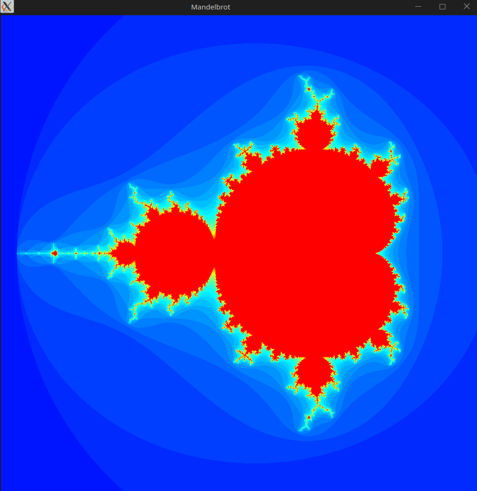

- [Mandelbrot](#mandelbrot)
- [Capabilities](#capabilities)
- [Controls](#controls)
- [Requirements](#requirements)
- [TODO](#todo)
- [Screenshots](#screenshots)

# Mandelbrot 

Mandelbrot set graphical visualizer.

Coloring of the individual pixel is based on the amount of iterations (in complex number domain) for the equation: 

`f(z) = z^2 + c`

Where:
- `z` and `c` are complex numbers. 
- `c` corresponds to the coordinates of a point on the XY plane (X real, Y complex)

For details see the [Mandelbrot set Wikipedia page](https://en.wikipedia.org/wiki/Mandelbrot_set)

The algorithm used to determine each pixel's color is independent of the neighboring pixels. It is therefore easily parallelizable.
The application utilizes shaders to delegate the calculations straight to the GPU.

# Capabilities

- smooth operation up to 1000 iterations 
- pan & zoom
- dynamic maximum iteration control
- colorful visualization with some manual customization options

# Controls 

- zoom in/out with the mouse wheel, or press `PgDn` and `PgUp`
- move the view by dragging the mouse or using keyboard arrows
- control the maximum amount of iterations with `+` and `-`

# Requirements

- C++17 enabled compiler
- CMake
- libsfml-dev

# TODO

- find an alternative way to pass the color map array to the shader
  - current implementation limits the number of iterations to the number of registers available in the GPU (probably GL_MAX_TEXTURE_SIZE)
- Make the customization of color map easier

# Screenshots

Default view

Reduced amount of iterations

Zoomed in

